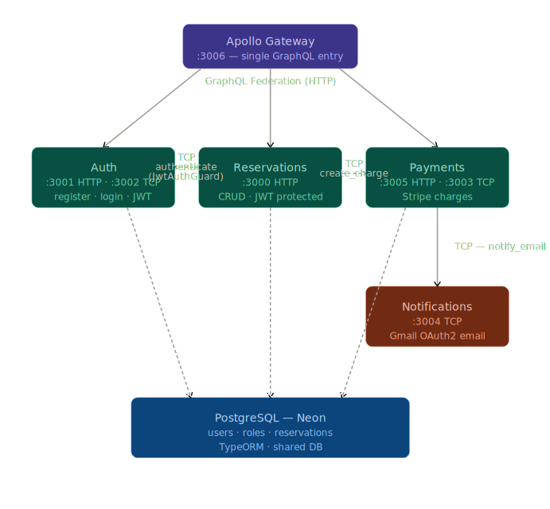

# Staybit 🏨

A production-grade hotel reservation platform built with a **NestJS microservices architecture**, **GraphQL Federation**, **Stripe payments**, and deployed on **AWS EKS** using Kubernetes + Helm.

This is the kind of project I built to go deep on everything at once — distributed systems, auth, payments, infra, CI/CD — all wired together and actually running in the cloud.

---

## What it does

Users can create an account, log in, and book a reservation with real card payment processing via Stripe. After a successful charge, they get an email confirmation. Admins can delete reservations. Everything is protected by JWT, and the whole thing is exposed through a single GraphQL endpoint via an API gateway.

---

## Architecture

Five independent NestJS services, each with its own responsibility, talking to each other over TCP (microservices) or HTTP (GraphQL Federation):



### Services

| Service           | Port(s)                 | Role                                                                   |
| ----------------- | ----------------------- | ---------------------------------------------------------------------- |
| **Gateway**       | 3006 (HTTP)             | Apollo Federation gateway — single GraphQL entry point for all clients |
| **Auth**          | 3001 (HTTP), 3002 (TCP) | User registration, login, JWT issuance, token validation               |
| **Reservations**  | 3000 (HTTP)             | CRUD for reservations, protected by JWT, triggers payment on creation  |
| **Payments**      | 3005 (HTTP), 3003 (TCP) | Stripe payment intent creation, emits email notification on success    |
| **Notifications** | 3004 (TCP)              | Sends transactional emails via Gmail OAuth2 using Nodemailer           |

---

## Tech stack

- **NestJS** — all services, monorepo via Nest CLI
- **GraphQL Federation v2** — Apollo Gateway + Apollo Federation Driver on each subgraph
- **PostgreSQL + TypeORM** — single DB, each service owns its own entities
- **JWT + Passport** — local strategy for login, JWT strategy for protected routes
- **Stripe** — payment intents for card charges
- **Nodemailer + Gmail OAuth2** — email notifications post-payment
- **Docker + Docker Compose** — local development
- **Kubernetes + Helm** — production deployment on AWS EKS
- **AWS CodeBuild** — CI/CD pipeline pushes images to ECR
- **Jest** — unit tests + containerized e2e test suite

---

## Getting started

### Prerequisites

- Node.js 20+
- Docker & Docker Compose
- A PostgreSQL instance (handled by Docker Compose)
- Stripe account (test keys are fine)
- Google OAuth2 credentials for Gmail

### Environment variables

Each service has its own `.env`. Here's what you need:

**Root `.env`** (for Postgres in Docker):

```env
POSTGRES_HOST=ep-your-db-name-pooler.c-1.us-east-1.aws.neon.tech
POSTGRES_PORT=5432
POSTGRES_USER=neondb_owner
POSTGRES_PASSWORD=your_password_here
POSTGRES_DB=neondb
POSTGRES_SYNCHRONIZE=true
```

**`apps/auth/.env`**:

```env
POSTGRES_HOST=ep-your-db-name-pooler.c-1.us-east-1.aws.neon.tech
POSTGRES_PORT=5432
POSTGRES_USER=neondb_owner
POSTGRES_PASSWORD=your_password_here
POSTGRES_SYNCHRONIZE=true
HTTP_PORT=3001
TCP_PORT=3002
JWT_SECRET=your_jwt_secret_here
JWT_EXPIRATION=3600
```

**`apps/reservations/.env`**:

```env
POSTGRES_HOST=ep-your-db-name-pooler.c-1.us-east-1.aws.neon.tech
POSTGRES_PORT=5432
POSTGRES_USER=neondb_owner
POSTGRES_PASSWORD=your_password_here
POSTGRES_SYNCHRONIZE=true
PORT=3000
AUTH_HOST=auth
AUTH_PORT=3002
PAYMENTS_HOST=payments
PAYMENTS_PORT=3003
```

**`apps/payments/.env`**:

```env
PORT_TCP=3003
PORT_HTTP=3005
STRIPE_SECRET_KEY=sk_test_your_stripe_secret_key_here
NOTIFICATIONS_HOST=notifications
NOTIFICATIONS_PORT=3004
```

**`apps/notifications/.env`**:

```env
PORT=3004
GOOGLE_OAUTH_CLIENT_ID=your_google_oauth_client_id.apps.googleusercontent.com
GOOGLE_OAUTH_CLIENT_SECRET=your_google_oauth_client_secret
GOOGLE_OAUTH_REFRESH_TOKEN=your_google_oauth_refresh_token
SMTP_USER=your_email@gmail.com
```

**`apps/gateway/.env`**:

```env
PORT=3006
AUTH_HOST=auth
AUTH_PORT=3002
RESERVATIONS_GRAPHQL_URL=http://reservations:3000/graphql
AUTH_GRAPHQL_URL=http://auth:3001/graphql
PAYMENTS_GRAPHQL_URL=http://payments:3005/graphql
```

### Run locally

```bash
# Install dependencies
npm install

# Start all services + Postgres
docker-compose up
```

The GraphQL playground is available at `http://localhost:3006/graphql`.

---

## API

Everything goes through the gateway at `/graphql`. Here are the main operations:

### Create a user

```graphql
mutation {
  createUser(
    createUserInput: {
      email: "you@example.com"
      password: "StrongPass1!"
      roles: [{ name: "Admin" }]
    }
  ) {
    id
    email
    roles {
      name
    }
  }
}
```

### Login

```bash
POST http://localhost:3001/auth/login
Content-Type: application/json

{ "email": "you@example.com", "password": "StrongPass1!" }
```

Returns a JWT. Pass it as the `Authentication` header on subsequent requests.

### Create a reservation

```graphql
mutation {
  createReservation(
    createReservationInput: {
      startDate: "2024-06-01"
      endDate: "2024-06-05"
      charge: {
        amount: 250
        card: {
          number: "4242 4242 4242 4242"
          cvc: "123"
          exp_month: 12
          exp_year: 2027
        }
      }
    }
  ) {
    id
    startDate
    endDate
    invoiceId
    userId
  }
}
```

This triggers a Stripe charge and sends a confirmation email in one shot.

### Other reservation operations

```graphql
# Get all
query {
  reservations {
    id
    startDate
    endDate
    invoiceId
  }
}

# Get one
query {
  reservation(id: 1) {
    id
    startDate
    endDate
  }
}

# Update
mutation {
  updateReservation(
    id: 1
    updateReservationInput: { startDate: "2024-06-02" }
  ) {
    id
  }
}

# Delete (Admin only)
mutation {
  removeReservation(id: 1) {
    id
  }
}
```

---

## Auth & authorization

- **Registration** → GraphQL mutation via gateway
- **Login** → REST `POST /auth/login` → returns JWT
- **Protected routes** → `JwtAuthGuard` validates token via TCP call to auth service
- **Role-based access** → `@Roles('Admin')` decorator, checked via the `Role` entity on the user
- **Gateway auth context** → extracts the `Authentication` header, validates via auth TCP service, injects `user` into GraphQL context — returns `null` gracefully if no token or invalid token (no hard 401s at gateway level)

---

## Testing

### Unit tests

```bash
npm run test
npm run test:cov
```

### E2E tests

E2E runs in Docker so the full stack is up:

```bash
npm run test:e2e
```

This spins up all services via `e2e/docker-compose.yaml` and runs the full reservation flow: create user → login → create reservation → fetch reservation → assert equality.

---

## Deployment

### CI/CD (AWS CodeBuild)

`buildspec.yaml` handles the pipeline:

1. Authenticate to Amazon ECR (`eu-north-1`)
2. Build Docker images for all 5 services
3. Tag and push to ECR

### Kubernetes (AWS EKS)

The cluster config (`cluster.yaml`) provisions an EKS cluster in `eu-north-1` with 3 `t3.micro` nodes.

Deploy with Helm:

```bash
helm upgrade --install staybit ./k8s/staybit
```

The Helm chart includes deployments and services for all 5 apps, plus an ALB Ingress that routes:

| Path                  | Service              |
| --------------------- | -------------------- |
| `/auth/*`             | auth-http `:3001`    |
| `/reservations/*`     | reservations `:3000` |
| `/` (everything else) | gateway `:3006`      |

Auth and payments each expose both HTTP and TCP services in Kubernetes (separate `service-http.yaml` and `service-tcp.yaml`).

---

## Project structure

```
staybit/
├── apps/
│   ├── auth/           # Auth service
│   ├── gateway/        # Apollo Federation gateway
│   ├── notifications/  # Email service
│   ├── payments/       # Stripe payments service
│   └── reservations/   # Reservations service
├── libs/
│   └── common/         # Shared lib: DB module, auth guards, decorators, health, logger, DTOs
├── e2e/                # Containerized end-to-end tests
├── k8s/staybit/        # Helm chart
├── buildspec.yaml      # AWS CodeBuild pipeline
├── cluster.yaml        # EKS cluster config
└── docker-compose.yaml # Local development
```

### Shared `common` library

Everything reused across services lives in `libs/common`:

- `DatabaseModule` — TypeORM setup with abstract entity and repository
- `HealthModule` — simple `GET /` health check endpoint, registered in all services
- `LoggerModule` — shared Pino logger
- `JwtAuthGuard` — JWT guard usable in any service
- `@CurrentUser()` — decorator to extract the authenticated user from HTTP or GraphQL context
- `@Roles()` — role-based access decorator
- `User` / `Role` entities — shared across services
- `CreateChargeDto` / `CardDto` — payment DTOs

---

## Health checks

Every service exposes a `GET /` endpoint that returns `{ status: 'ok' }`. Used by Kubernetes liveness/readiness probes.

---

## Notes

- The gateway forwards the authenticated user to downstream subgraphs by injecting it as a `user` HTTP header (JSON stringified). Each subgraph reads this header to get the current user without re-validating the JWT.
- Payments use Stripe's `pm_card_visa` test payment method so you don't need a real card in development.
- CSRF protection is disabled on the gateway (`csrfPrevention: false`) to allow direct GraphQL Playground access.
- In production, the Apollo landing page plugin switches to the production variant automatically based on `NODE_ENV`.
